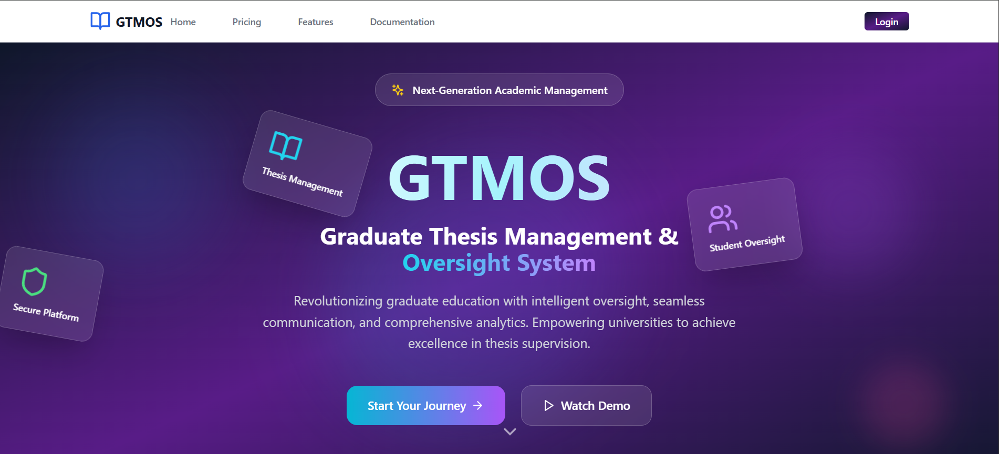
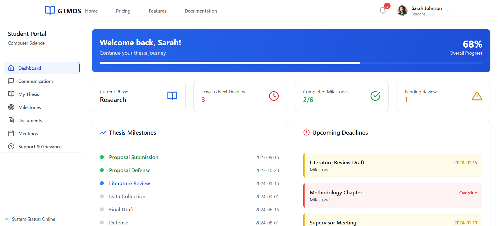
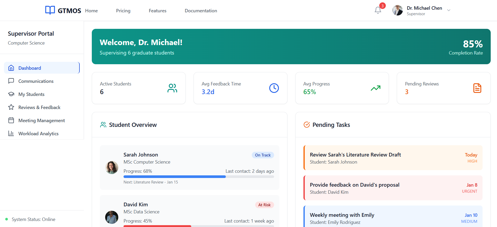
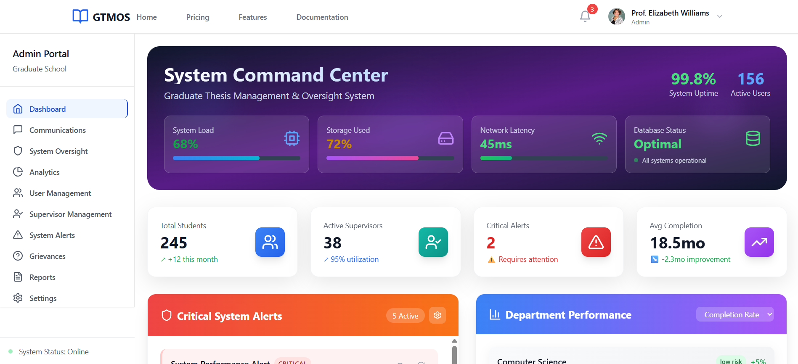

# Project: Comprehensive Thesis Management System

## Overview

Project Bolt is a robust and intuitive web application designed to streamline the thesis management process for students, supervisors, and administrators within a university setting. It offers a modular and scalable architecture built with React and TypeScript, ensuring maintainability and extensibility.

## Key Features

### For Students
- **Thesis Overview:** Centralized dashboard to track thesis progress, key metrics like chapters completed and word count, with visual progress charts.
- **Milestones Tracking:** Manage thesis milestones with status updates, due dates, and document uploads.
- **Support & Grievance Center:** Access confidential support services, submit grievances, and find academic and mental health resources.

### For Supervisors
- **Student Management:** Oversee assigned students, track progress, communication history, and performance metrics.
- **Reviews & Feedback:** Manage document reviews, provide structured feedback, and analyze review times.
- **Meetings Management:** Schedule and track meetings with agendas, summaries, and action items.
- **Workload Analytics:** Insights into student load, time allocation, and performance metrics.

### For Administrators
- **Analytics Dashboard:** System-wide metrics including enrollment trends, completion rates, and predictive insights.
- **Supervisor Management:** Administer supervisor profiles and monitor workload.
- **Communications Oversight:** Monitor communication volume, response times, and flag issues.
- **System Oversight & Alerts:** Real-time monitoring of system health, security alerts, and user activity.

## Technology Stack

- **Frontend:** React.js, TypeScript, Tailwind CSS
- **Build Tool:** Vite
- **Icons:** Lucide React

## Project Structure

```
project/
├── src/
│   ├── components/
│   │   ├── Admin/
│   │   ├── Auth/
│   │   ├── Communications/
│   │   ├── Dashboard/
│   │   ├── Layout/
│   │   ├── Student/
│   │   ├── Supervisor/
│   │   └── Welcome/
│   ├── contexts/
│   ├── types/
│   ├── main.tsx
│   ├── index.css
│   └── ...
├── public/
│   └── assets/
│       └── project-bolt-logo.png
├── package.json
├── tailwind.config.js
└── vite.config.ts
```

## Installation

1. Clone the repository:

```bash
git clone https://github.com/Jodick-Ndayisenga/gtmos.git
cd gtmos
```

2. Install dependencies:

```bash
npm install
```

## Running the Application

Start the development server:

```bash
npm run dev
```

Open your browser and navigate to `http://localhost:5173`.

## Usage

- Navigate through the app using the responsive navigation bar.
- Login with your credentials to access role-specific features.
- Switch roles dynamically if you have multiple roles assigned.
- Access notifications and user settings from the navbar.

## Screenshots

### Welcome Page with Navigation Bar



### Student Dashboard



### Supervisor Reviews



### Admin Analytics



## Contributing

We welcome contributions! Please fork the repository and submit pull requests. Follow these guidelines:

- Write clear, concise commit messages.
- Ensure code follows existing style and conventions.
- Include tests for new features or bug fixes.
- Update documentation as needed.

## License

This project is licensed under the MIT License.

## Contact

For questions or support, please open an issue or contact the maintainer.
